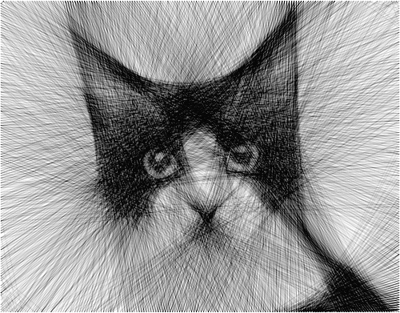
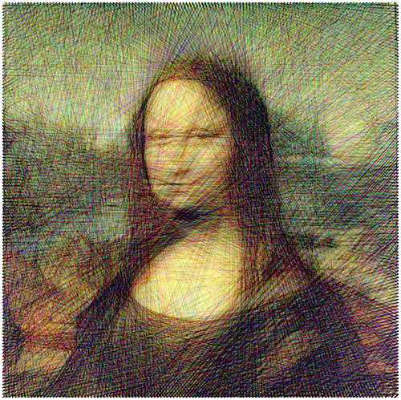
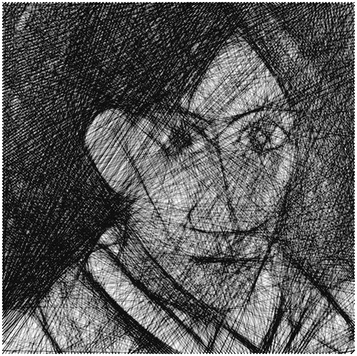
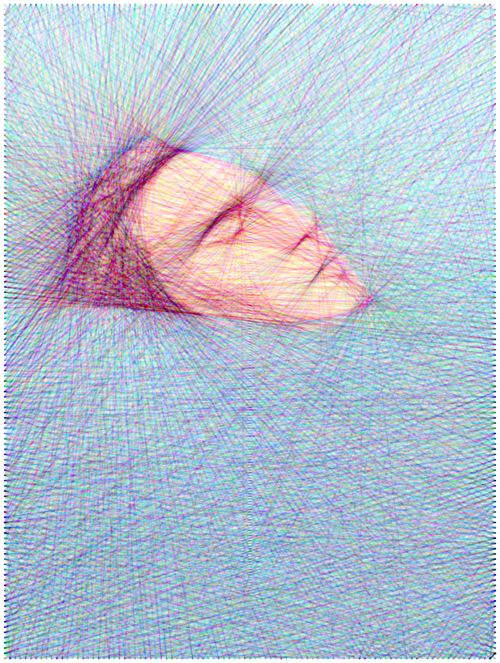

# image-stylization-threading

## Description
This tool generates string art from any picture of your choice. Pegs are first placed on the frame, and then a single-color thread is repeatedly ran from peg to peg in a straight line. The stacked segments progressively recreate the original image. This process was popularized by Petros Vrellis.

The monochrome mode uses a single thread, while the color mode uses 3 distinct threads. The result can be exported in the SVG format.

See it live [here](https://piellardj.github.io/image-stylization-threading).

